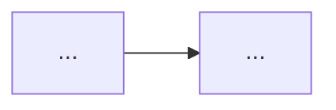

# Design: [タスク名]

<!-- このファイルは `.steering/_template/design.md` をコピーした雛形です。
     使い方: `docs/development-workflow.md` Phase 1 を参照。 -->

## 1. 実装アプローチの概要

<!-- 全体方針を 1〜2 段落で -->

## 2. アーキテクチャ変更

<!-- 既存構成からの差分。必要なら Mermaid で before/after 図 -->

## 3. サービス別の変更点

### service-a
<!-- 変更するファイル、新規追加、削除 -->

### service-b
<!-- 同上 -->

### service-c
<!-- 同上 -->

## 4. API 契約の変更

<!-- 新規エンドポイント、リクエスト/レスポンス形状、エラーコード。
     実測で検証すべき断定があれば明記（docs/lessons-learned.md#設計段階の実測検証ルール）-->

## 5. データ構造の変更

<!-- DB スキーマ、マイグレーション、既存データの取り扱い -->

## 6. 横断的制約 (Agent Teams 用)

<!-- rate limit / セッション / middleware / seed データ / 構造化エラー規約など、
     各 Agent 起動時に伝えるべき制約を列挙 -->

## 7. 影響範囲の分析

<!-- 変更が他サービス・既存機能に与える影響。後方互換性 -->

## 8. 検証済みの前提（実測）

<!-- design.md で断定している内容のうち、実測で検証した項目を記述。
     未検証の断定は「仮説」として明記する。 -->

## 9. リスクと代替案

<!-- 想定されるリスクと、採用しなかった代替案の理由 -->

---

**関連ドキュメント:**
- [requirements.md](requirements.md)
- [tasklist.md](tasklist.md)
