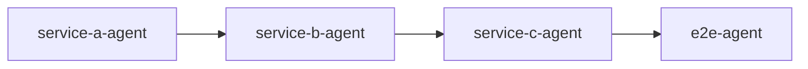

# Tasklist: [タスク名]

<!-- このファイルは `.steering/_template/tasklist.md` をコピーした雛形です。
     使い方: `docs/development-workflow.md` Phase 1/2 を参照。 -->

## 実装パターン

<!-- docs/development-workflow.md の「Agent 構成の判断基準」から選ぶ -->

- [ ] パターン 1: 全 Agent 並行起動（API 契約確定済み）
- [ ] パターン 2: 段階的起動（依存あり）
- [ ] パターン 3: 単一 Agent（単一サービス内で完結）

## Agent 別タスク分担

### Service-A Agent
- [ ] <!-- 具体的なタスク -->
- [ ]

**参照ドキュメント:**
- `services/service-a/CLAUDE.md`
- `services/service-a/docs/functional-design.md`
- `contracts/openapi/...`

### Service-B Agent
- [ ]
- [ ]

### Service-C Agent
- [ ]
- [ ]

### E2E Test Agent
- [ ]

## Agent 間の依存関係

<!-- どの Agent がどの Agent の完了を待つか。
     ハンドオフは Orchestrator の明示的 wake-up DM で行う
     （docs/lessons-learned.md#ハンドオフの必須ルール）-->

## 横断的制約（各 Agent 起動時に埋め込む）

<!-- design.md の「横断的制約」から転記。rate limit / セッション / middleware /
     seed データ / 構造化エラー規約 等 -->

## 完了条件

- [ ] すべてのタスクが完了している
- [ ] `/review-implementation` で Critical/High 指摘がない
- [ ] 全テストが通っている
- [ ] ドキュメントが更新されている
- [ ] `/retrospective` を実施した

---

**関連ドキュメント:**
- [requirements.md](requirements.md)
- [design.md](design.md)
