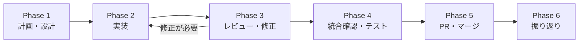

# 開発ワークフロー

## 1. 概要

### SPEC 駆動型開発とは

このプロジェクトでは **SPEC 駆動型開発（Steering-driven / Specification-driven Development）** を採用しています。実装を開始する前に、ステアリングファイル（requirements.md, design.md, tasklist.md）で「何を」「なぜ」「どう作るか」を明文化し、その仕様に基づいて実装・レビュー・振り返りまでを一貫して進めるアプローチです。

### なぜこのワークフローか

- **品質**: 仕様を事前に確定することで、手戻りや仕様漏れを最小化する
- **再現性**: スキル（スラッシュコマンド）により、誰が実行しても同じ手順で開発を進められる
- **Agent Teams 活用**: ステアリングファイルが Agent 間の共通言語となり、並行実装を可能にする
- **チーム開発**: 設計意図と経緯がドキュメントに残り、新メンバーのオンボーディングが容易になる

---

## 2. 開発ワークフロー全体像



### 各フェーズの概要

| Phase | 名称 | 概要 | Agent 構成 | 主なスキル |
|-------|------|------|-----------|-----------|
| 1 | 計画・設計 | ステアリングファイルを作成し、レビュー・承認を得る | 単一 Agent | `/plan-task`, `/review-steering` |
| 2 | 実装 | Agent Teams で各サービスを並行実装する | Agent Teams | `/start-implementation` |
| 3 | レビュー・修正 | 成果物をステアリング仕様と照合しレビューする | 単一 Agent | `/review-implementation` |
| 4 | 統合確認・テスト | 全サービスを起動し、統合動作を確認する | 単一 Agent | `/run-tests` |
| 5 | PR・マージ | PR 準備チェックを実施し、サブモジュール順に PR を作成する | 単一 Agent | `/prepare-pr` |
| 6 | 振り返り | 定量データと主観的フィードバックから改善アクションを導出する | 単一 Agent | `/retrospective` |

---

## 3. Phase 1: 計画・設計

### 使用スキル

```
/plan-task
/review-steering <steering-directory-name>
```

### 手順

1. **`/plan-task` を実行** - 対話形式でヒアリングが始まり、以下を収集する
   - タスクの基本情報（名前、概要、背景）
   - 影響範囲
   - タスクサイズ判定
   - 技術的変更点
   - 非機能要件、受け入れ条件、制約事項

2. **ステアリングファイルが自動生成される**
   - `requirements.md` / `design.md` / `tasklist.md`

3. **1 ファイルごとにユーザー承認**を得る

4. **`/review-steering` でレビュー**

5. **main ブランチにコミット・プッシュ**

### ステアリングディレクトリの命名規則

```
.steering/[YYYYMMDD]-[開発タイトル]/
```

### ポイント

- **この段階では単一 Agent を使用する**（コスト最適化）
- タスクサイズが大きい場合は分割を推奨される

---

## 4. Phase 2: 実装

### 使用スキル

```
/start-implementation <steering-directory-name>
```

### Agent 構成の判断基準

| パターン | 条件 | Agent 構成 |
|---------|------|----------|
| 1. 全 Agent 並行起動 | API 契約確定済み、複数サービスにまたがる | 全サービス Agent を同時起動 |
| 2. 段階的起動 | 下流サービス依存、API 契約未確定 | 上流先行 → API 契約確定後に下流起動 |
| 3. 単一 Agent | 単一サービス内で完結する変更 | 該当サービスの Agent のみ起動（Agent Teams 不使用）|

パターン 3 を選ぶべきケースの詳細: [`lessons-learned.md#パターン-3-単一-agent-を選ぶべきケース`](lessons-learned.md#パターン-3-単一-agent-を選ぶべきケース)

### Agent 間通信ルール（フルメッシュ型）

| 通信種別 | ルート | 例 |
|---------|--------|-----|
| Orchestrator 経由必須 | 設計方針変更、API 契約変更 | エンドポイントの追加・削除 |
| 直接通信 DM が必須 | 実装の暗黙前提共有 | クエリのハードコード、レスポンス形状の選択 |
| 直接通信 DM 推奨 | 実装詳細の確認 | メソッド名・型名の質問 |

### ポイント

- **Orchestrator は常にフォアグラウンドでユーザー応答可能な状態を維持する**
- `CLAUDE_CODE_EXPERIMENTAL_AGENT_TEAMS=1` を設定し、`TeamCreate` + `team_name` で真の Agent Teams を成立させる
- ハンドオフは Orchestrator の明示的 wake-up DM が必要（詳細: [`lessons-learned.md#ハンドオフの必須ルール`](lessons-learned.md#ハンドオフの必須ルール)）

---

## 5. Phase 3: レビュー・修正

### 使用スキル

```
/review-implementation <steering-directory-name>
```

### レビュー手順

1. ステアリングファイル読み込み
2. `git diff main...HEAD` で差分特定
3. 静的解析・テスト実行
4. チェックリスト実行
5. 問題点のレポート出力

### レビュー項目

| カテゴリ | チェック内容 |
|---------|------------|
| ステアリング準拠性 | 受け入れ条件充足、設計通りの実装か |
| 機能過不足 | スコープ外の実装、必須機能の漏れ |
| API 契約 | 仕様との一致、HTTP ステータスコード |
| 用語統一 | `docs/glossary.md` の用語使用 |
| セキュリティ | 認証・認可、入力検証、データ保護 |
| パフォーマンス | N+1、不要な API 呼び出し |
| コンプライアンス | 監査証跡、職務分掌、アクセス制御（該当する場合）|
| コード品質 | lint、テスト、可読性、DRY 原則 |
| ドキュメント整合性 | glossary.md、API 仕様の更新漏れ |

### 問題の重要度分類

| 重要度 | 説明 | 対応 |
|-------|------|------|
| Critical | セキュリティ脆弱性、重大な仕様逸脱 | 必ず修正 |
| High | 機能不足、パフォーマンス、API 契約違反 | 必ず修正 |
| Medium | コード品質、用語不統一、ドキュメント未更新 | 可能な限り修正 |
| Low | コードスタイル、コメント不足 | 優先度に応じて対応 |

### ポイント

- **長寿命 Team パターン**で実装 → レビュー → 修正を同一 Team で実行する（詳細: [`lessons-learned.md#長寿命-team-パターン`](lessons-learned.md#長寿命-team-パターン)）
- Critical/High 問題がすべて解消されるまで Phase 4 に進まない

---

## 6. Phase 4: 統合確認・テスト

<!-- TODO(claude): 実プロジェクトのビルド/起動/テストコマンドに置き換えてください -->

### 手順

1. **全サービスを起動** (`docker compose up -d --build` 等)
2. **API 動作確認** (curl 等)
3. **E2E テスト実行**
4. **デグレーションテスト** — 既存テストがすべてパスすることを確認
5. **監査記録の確認**（該当する場合）

---

## 7. Phase 5: PR・マージ

### 使用スキル

```
/prepare-pr <steering-directory-name>
```

### 準備チェックリスト

1. `/review-implementation` で Critical/High 問題がないことを確認
2. リント・型チェック通過
3. 全テスト成功
4. コミットメッセージの確認
5. 不要ファイル・デバッグコード・機密情報の除外確認
6. ドキュメント同期確認（`/check-docs-sync`）
7. main ブランチの最新変更を rebase

### サブモジュール構成での PR 作成順序

1. **各サブモジュールで PR を作成**（並行レビュー可能）
2. **サブモジュール PR をマージ**
3. **親リポジトリでサブモジュール参照を更新し、PR を作成**

---

## 8. Phase 6: 振り返り

### 使用スキル

```
/retrospective <steering-directory-name>
```

### 手順

1. **定量データの自動収集** - コミット数、変更行数、テスト数、レビュー指摘件数
2. **3 つの質問**:
   - うまくいったこと
   - 改善点
   - 想定外だったこと
3. **改善アクションの提案**
4. **`retrospective.md` として保存** - `.steering/<ディレクトリ>/retrospective.md`
5. **承認されたアクションの反映** — CLAUDE.md 更新、テンプレート修正、スキル改善、`lessons-learned.md` への学び追記など

### ポイント

- 5 分程度で完了する軽量な設計
- 新しい知見が得られた場合は [`lessons-learned.md`](lessons-learned.md) に追記する

---

## 9. 利用可能なスキル一覧

| スキル | 用途 | 使用 Phase |
|--------|------|----------|
| `/plan-task` | ステアリングファイルの対話的作成 | Phase 1 |
| `/review-steering` | ステアリングファイルの品質レビュー | Phase 1 |
| `/start-implementation` | Agent Teams 並行実装の開始 | Phase 2 |
| `/review-implementation` | 成果物のステアリング準拠性レビュー | Phase 3 |
| `/run-tests` | 全サービスのテスト実行 | Phase 4 |
| `/prepare-pr` | PR 作成前のチェックリスト実行 | Phase 5 |
| `/retrospective` | タスク完了後の振り返り | Phase 6 |
| `/check-docs-sync` | コードとドキュメントの同期確認 | Phase 3, 5 |
| `/analyze-impact` | マイクロサービス横断の変更影響分析 | Phase 1 |
| `/debug-issue` | 開発・本番環境の問題調査 | 随時 |
| `/submodule-sync` | 全サブモジュールの最新コミット同期 | 随時 |
| `/setup-dev-env` | 新メンバー向け開発環境セットアップ | 初回のみ |

---

## 10. コスト最適化

| 作業 | 推奨 Agent 構成 | 理由 |
|------|-------------|------|
| ドキュメント作成 | 単一 Agent | 順次作業で十分 |
| ステアリングファイルレビュー | 単一 Agent | 1 つのコンテキストで完結 |
| 複数サービスの並行実装 | Agent Teams | 並行実装で時間短縮 |
| 単一サービスの修正 | 単一 Agent | Agent Teams のオーバーヘッドが無駄 |
| レビュー・振り返り | 単一 Agent | 横断的な視点で担当 |
