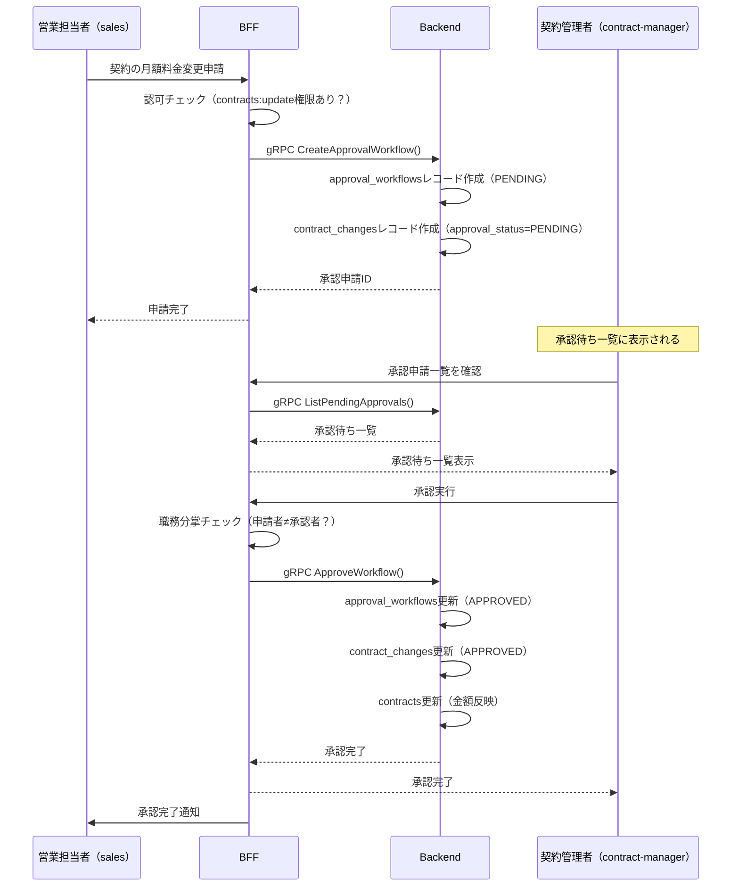

# J-SOX 対応設計書

<!-- TODO(claude): このファイルは日本の財務報告に関わるシステムで必要となる J-SOX 対応の
     リファレンスとして同梱されています。該当しないプロジェクトではこのファイルごと削除して
     かまいません。該当する場合は、具体的なエンティティ名（merchant / contract 等）を
     実プロジェクトのドメインに置き換えてください。 -->

## 概要

本ドキュメントは、財務報告に影響を与えるシステムにおける J-SOX（日本版 SOX 法：金融商品取引法）対応の設計テンプレートです。

**J-SOXの目的:**
内部統制の有効性を担保し、財務報告の信頼性を確保すること

**本システムの対象範囲:**
契約金額を扱う契約管理システムは財務報告に影響を与えるため、J-SOX対応が必須です。

---

## J-SOX 4つの統制目標

### 1. 実在性（Existence）
記録されたデータが実際に存在することを保証

### 2. 網羅性（Completeness）
すべての取引が漏れなく記録されることを保証

### 3. 権利と義務（Rights and Obligations）
記録された取引が正当な権利・義務に基づくことを保証

### 4. 評価の妥当性（Valuation）
記録された金額が正確であることを保証

---

## システム実装における5つの統制要素

### 1. 監査証跡（Audit Trail）
### 2. 職務分掌（Segregation of Duties）
### 3. アクセス制御（Access Control）
### 4. データ保護（Data Protection）
### 5. 承認フロー（Approval Workflow）

---

## 1. 監査証跡（Audit Trail）

### 目的
すべてのデータ変更を記録し、「誰が・いつ・何を・どう変更したか」を後から追跡可能にする

### 実装箇所

#### 1-1. BFF監査ログ（audit_logs テーブル）

**目的:** すべてのAPI呼び出しを記録

**記録内容:**
- **user_id**: 操作したユーザー
- **action**: 操作内容（例: CREATE_CONTRACT, UPDATE_CONTRACT）
- **resource_type**: リソース種別（contract, merchant）
- **resource_id**: リソースID
- **request_method**: HTTPメソッド（GET, POST, PUT, DELETE）
- **request_path**: APIパス（例: /api/contracts/123）
- **request_body**: リクエストボディ（機密情報はマスク）
- **response_status**: レスポンスステータス（200, 400, 500等）
- **ip_address**: クライアントIPアドレス
- **user_agent**: ユーザーエージェント
- **created_at**: 実行日時

**保管期間:** 最低7年間（J-SOX要件）

**実装サービス:** BFF

**詳細設計:** `services/bff/docs/functional-design.md`

---

#### 1-2. Backend契約変更履歴（contract_changes テーブル）

**目的:** 契約データのすべての変更を記録

**記録内容:**
- **contract_id**: 変更対象の契約ID
- **change_type**: 変更種別（CREATE, UPDATE, DELETE）
- **field_name**: 変更されたフィールド名（例: monthly_fee）
- **old_value**: 変更前の値
- **new_value**: 変更後の値
- **changed_by**: 変更者のユーザーID（BFFから渡される）
- **changed_at**: 変更日時
- **approval_status**: 承認ステータス（PENDING, APPROVED, REJECTED）
- **approved_by**: 承認者のユーザーID
- **approved_at**: 承認日時

**保管期間:** 永久保管（削除不可）

**実装サービス:** Backend

**詳細設計:** `services/backend/docs/functional-design.md`

---

### 監査証跡の実装ルール

#### ルール1: 自動記録
すべてのデータ変更は、アプリケーションレベルで自動的に記録されること
- データベーストリガーではなく、アプリケーションコードで実装
- ビジネスロジックと密結合させる

#### ルール2: 改ざん防止
監査ログ・変更履歴テーブルは書き込み専用（DELETE/UPDATE不可）
```sql
-- PostgreSQLルールで削除・更新を禁止
CREATE RULE audit_logs_no_delete AS ON DELETE TO audit_logs DO INSTEAD NOTHING;
CREATE RULE audit_logs_no_update AS ON UPDATE TO audit_logs DO INSTEAD NOTHING;
```

#### ルール3: 機密情報のマスキング
リクエストボディにパスワード等の機密情報が含まれる場合はマスクして記録
```typescript
// 例: パスワードをマスク
const maskedBody = maskSensitiveFields(requestBody, ['password', 'token']);
```

#### ルール4: 監査ログの検索性
監査ログは以下の条件で検索可能であること
- ユーザーIDで検索
- リソース種別・IDで検索
- 期間で検索
- 操作内容で検索

---

## 2. 職務分掌（Segregation of Duties, SoD）

### 目的
不正行為を防ぐため、重要な業務プロセスを複数の担当者に分離する

### 実装ルール

#### ルール1: 登録者と承認者の分離
金額変更を伴う契約の更新は、登録者と承認者を分離すること

**実装:**
- 契約の金額変更（monthly_fee, initial_fee）は必ず承認フローを経由
- 承認者は登録者と異なるユーザーでなければならない
- システムレベルで強制チェック

```typescript
// 承認時のチェック
if (approvalWorkflow.requested_by === currentUserId) {
  throw new Error('登録者と承認者を分離してください（職務分掌違反）');
}
```

#### ルール2: 権限ベースのアクセス制御
権限（Permission）単位で実行可能な操作を制限

**重要:** ロール名をハードコードせず、権限ベースでチェックすること

**権限チェックの実装例:**
```typescript
// ❌ ロール名でのハードコードは禁止
if (user.role === 'SYSTEM_ADMIN') { ... }
if (user.role === 'CONTRACT_MANAGER') { ... }

// ✅ 権限ベースでチェック
if (await hasPermission(user.id, 'contracts:create')) { ... }
if (await hasPermission(user.id, 'contracts:approve')) { ... }
if (await hasPermission(user.id, 'audit:read')) { ... }
```

**初期権限マトリクス例:**

| 権限 | system-admin | contract-manager | sales | viewer |
|------|-------------|-----------------|-------|--------|
| contracts:create | ✅ | ✅ | ✅ | ❌ |
| contracts:update | ✅ | ✅ | ✅ | ❌ |
| contracts:approve | ✅ | ✅ | ❌ | ❌ |
| contracts:read | ✅ | ✅ | ✅ | ✅ |
| audit:read | ✅ | ✅ | ❌ | ❌ |
| roles:manage | ✅ | ❌ | ❌ | ❌ |

**実装サービス:** BFF（認可チェック）

**DBテーブル:**
- `roles`: ロール定義
- `permissions`: 権限定義
- `role_permissions`: ロールと権限の紐付け
- `user_roles`: ユーザーとロールの紐付け

---

### 承認フローの実装

#### 金額変更時の承認フロー



**承認が必要な変更:**
- monthly_fee（月額料金）
- initial_fee（初期費用）

**承認不要な変更:**
- notes（備考）
- contact_person（担当者名）等の参照情報

---

## 3. アクセス制御（Access Control）

### 目的
権限のないユーザーによる不正なデータアクセスを防止

### 実装ルール

#### ルール1: 権限ベースアクセス制御（Permission-Based Access Control）
すべてのAPIエンドポイントに権限チェックを実装

**実装サービス:** BFF

**重要:** ロール名ではなく、権限名でチェックすること

**実装例:**
```typescript
// ❌ ロール名でのチェックは禁止
app.get('/api/contracts',
  authenticate,
  authorize(['SYSTEM_ADMIN', 'CONTRACT_MANAGER', 'SALES', 'VIEWER']),  // これはNG
  getContracts
);

// ✅ 権限ベースでチェック
app.get('/api/contracts',
  authenticate,
  requirePermission('contracts:read'),  // 権限ベース
  getContracts
);

app.post('/api/contracts/:id/approve',
  authenticate,
  requirePermission('contracts:approve'),  // 承認権限が必要
  approveContractChange
);

app.get('/api/audit-logs',
  authenticate,
  requirePermission('audit:read'),  // 監査ログ閲覧権限
  getAuditLogs
);

// requirePermission 実装イメージ
function requirePermission(permissionName: string) {
  return async (req, res, next) => {
    const hasPermission = await checkUserPermission(req.user.id, permissionName);
    if (!hasPermission) {
      return res.status(403).json({ error: 'Permission denied' });
    }
    next();
  };
}

// DBから権限をチェック
async function checkUserPermission(userId: string, permissionName: string): Promise<boolean> {
  const result = await prisma.$queryRaw`
    SELECT EXISTS(
      SELECT 1 FROM user_roles ur
      JOIN role_permissions rp ON ur.role_id = rp.role_id
      JOIN permissions p ON rp.permission_id = p.permission_id
      WHERE ur.user_id = ${userId}
        AND p.permission_name = ${permissionName}
    ) as has_permission
  `;
  return result[0].has_permission;
}
```

#### ルール2: データレベルのアクセス制御
ユーザーが閲覧できるデータを制限（将来拡張）

**例:**
- 営業担当者は自分が担当する加盟店のみ閲覧可能（将来実装）
- 現在は権限単位での制御のみ

---

### セッション管理

#### セッションタイムアウト
- **アイドルタイムアウト:** 30分
- **絶対タイムアウト:** 8時間（1営業日）

#### セッション無効化
- ログアウト時
- パスワード変更時
- ロール変更時

#### セッションセキュリティ
- Cookie属性: `HttpOnly`, `Secure`, `SameSite=Strict`
- セッショントークン: ランダム生成（UUID v4）
- セッション固定攻撃対策: ログイン成功時にセッションID再生成

**実装サービス:** BFF

---

## 4. データ保護（Data Protection）

### 目的
データの機密性・完全性・可用性を保護

### 暗号化

#### 転送中の暗号化
- **外部通信（Frontend ↔ BFF）:** HTTPS（TLS 1.3）
- **内部通信（BFF ↔ Backend）:** gRPC（平文、将来mTLS検討）

#### 保存時の暗号化
- **データベース全体:** Amazon RDS暗号化（AES-256）
- **パスワード:** bcryptでハッシュ化（ソルト込み、コスト係数12）
- **機密情報（将来）:** アプリケーションレベルで暗号化（AES-256-GCM）

**実装例（パスワードハッシュ化）:**
```typescript
import bcrypt from 'bcrypt';

// ユーザー登録時
const saltRounds = 12;
const passwordHash = await bcrypt.hash(password, saltRounds);

// ログイン時
const isValid = await bcrypt.compare(password, user.password_hash);
```

---

### データバックアップ

#### バックアップ方針
- **頻度:** 日次（毎日深夜2時）
- **保管期間:** 30日間
- **バックアップ範囲:** BFF DB、Backend DB両方
- **リストア訓練:** 四半期に1回実施

#### Point-in-Time Recovery
- Amazon RDSのPITR機能を有効化
- 過去35日間の任意時点にリストア可能

---

### データ削除ポリシー

#### 論理削除
契約・加盟店データは物理削除せず、論理削除フラグで管理
```sql
-- 例: 加盟店の論理削除
UPDATE merchants SET is_active = false, updated_at = NOW() WHERE id = ?;
```

#### 物理削除の禁止
以下のテーブルは物理削除を禁止（J-SOX要件）
- `audit_logs`（BFF DB）
- `contract_changes`（Backend DB）
- `approval_workflows`（Backend DB）

---

## 5. 承認フロー（Approval Workflow）

### 目的
重要なデータ変更に対して複数人によるチェック機構を設ける

### 承認フローの実装

#### 承認が必要なケース
1. **契約の金額変更**
   - monthly_fee（月額料金）の変更
   - initial_fee（初期費用）の変更

#### 承認フローのステータス
- `PENDING`: 承認待ち
- `APPROVED`: 承認済み
- `REJECTED`: 却下

#### 承認ワークフローテーブル（approval_workflows）

**主要フィールド:**
- `contract_id`: 変更対象の契約ID
- `change_request`: 変更内容（JSON形式）
  ```json
  {
    "field": "monthly_fee",
    "old_value": "10000",
    "new_value": "15000",
    "reason": "サービスグレードアップに伴う料金改定"
  }
  ```
- `requested_by`: 申請者のユーザーID
- `requested_at`: 申請日時
- `status`: 承認ステータス
- `approved_by`: 承認者のユーザーID
- `approved_at`: 承認日時
- `rejection_reason`: 却下理由（却下時のみ）

**実装サービス:** Backend

---

### 承認フローのビジネスルール

#### ルール1: 金額変更は必ず承認フロー経由
金額フィールドの直接更新を禁止し、必ず承認ワークフローを経由させる

```typescript
// ❌ 金額の直接更新は禁止
await prisma.contract.update({
  where: { id: contractId },
  data: { monthly_fee: newFee }  // これは許可しない
});

// ✅ 承認ワークフローを作成
await prisma.approvalWorkflow.create({
  data: {
    contract_id: contractId,
    change_request: JSON.stringify({ field: 'monthly_fee', old_value: oldFee, new_value: newFee }),
    requested_by: userId,
    status: 'PENDING'
  }
});
```

#### ルール2: 職務分掌の強制
承認者は申請者と異なること（システムレベルでチェック）

```typescript
// 承認実行時のチェック
if (workflow.requested_by === approverId) {
  throw new ForbiddenError('申請者と承認者は異なるユーザーである必要があります（職務分掌要件）');
}
```

#### ルール3: 承認後のデータ反映
承認完了後、自動的に契約データに反映される

```typescript
// 承認処理
await prisma.$transaction(async (tx) => {
  // 1. ワークフロー更新
  await tx.approvalWorkflow.update({
    where: { id: workflowId },
    data: { status: 'APPROVED', approved_by: approverId, approved_at: new Date() }
  });

  // 2. 契約変更履歴記録
  await tx.contractChange.create({
    data: {
      contract_id: workflow.contract_id,
      change_type: 'UPDATE',
      field_name: changeRequest.field,
      old_value: changeRequest.old_value,
      new_value: changeRequest.new_value,
      changed_by: workflow.requested_by,
      approval_status: 'APPROVED',
      approved_by: approverId,
      approved_at: new Date()
    }
  });

  // 3. 契約データ反映
  await tx.contract.update({
    where: { id: workflow.contract_id },
    data: { [changeRequest.field]: changeRequest.new_value }
  });
});
```

#### ルール4: 却下時の処理
却下された場合は、契約データに反映せず、却下理由を記録

---

## J-SOX監査対応

### 監査時に提示する情報

#### 1. 監査証跡レポート
- 期間を指定して監査ログを抽出
- ユーザー別・操作別のサマリー
- CSV/Excel形式でエクスポート

#### 2. 契約変更履歴レポート
- 特定の契約の全変更履歴
- 金額変更の承認履歴
- 承認者と申請者の分離状況

#### 3. アクセス権限マトリクス
- ユーザー一覧とロール
- ロール別の権限一覧
- 職務分掌の実装状況

#### 4. システム統制証跡
- セキュリティパッチ適用履歴
- データバックアップ実施記録
- システム変更管理記録

---

## 内部統制の運用ルール

### 1. ユーザー管理
- **ユーザー登録:** システム管理者のみ実行可能
- **ロール変更:** システム管理者のみ実行可能、変更は監査ログに記録
- **アカウント無効化:** 退職・異動時は即座に無効化（is_active=false）

### 2. 定期レビュー
- **四半期レビュー:**
  - ユーザーアカウントの棚卸し
  - 監査ログの異常検知
  - 職務分掌の遵守状況確認

- **年次レビュー:**
  - J-SOX統制の有効性評価
  - リスクアセスメント
  - 統制文書の更新

### 3. インシデント対応
- **不正アクセス検知時:**
  1. 該当アカウントの即座停止
  2. 監査ログの保全
  3. 影響範囲の調査
  4. 上長への報告

---

## 開発時の注意事項

### すべてのAgentが遵守すべきこと

#### Frontend Agent
- 金額入力フィールドは編集不可、承認申請ボタンのみ表示
- 承認待ち状態の表示（UIでステータス表示）

#### BFF Agent
- すべてのAPIエンドポイントに認証・認可チェックを実装
- 監査ログ記録を忘れない（ミドルウェアで自動化推奨）
- 職務分掌チェックを厳密に実装

#### Backend Agent
- データ変更時は必ず`contract_changes`に記録
- 金額変更時は承認フロー経由を強制
- トランザクション境界を正しく設定（承認処理は1トランザクション）

---

## まとめ

本システムのJ-SOX対応は以下の5つの柱で実現されます：

1. **監査証跡:** すべてのAPI呼び出しとデータ変更を記録
2. **職務分掌:** 登録者と承認者を分離
3. **アクセス制御:** ロールベースで権限を厳密に管理
4. **データ保護:** 暗号化とバックアップで機密性・可用性を確保
5. **承認フロー:** 金額変更は必ず複数人チェック

すべてのAgentは、このドキュメントの要件を厳密に実装してください。
不明点がある場合は、`docs/glossary.md`や`docs/system-architecture.md`を参照してください。

---

**関連ドキュメント:**
- [product-requirements.md](product-requirements.md) - NFR-4: J-SOX対応
- [system-architecture.md](system-architecture.md) - 認証・認可アーキテクチャ
- [glossary.md](glossary.md) - 用語定義（監査証跡、職務分掌等）
- [security-guidelines.md](security-guidelines.md) - セキュリティ実装ガイドライン

**実装詳細:**
- `services/bff/docs/functional-design.md` - BFF DBのaudit_logsテーブル設計
- `services/backend/docs/functional-design.md` - Backend DBのcontract_changes、approval_workflowsテーブル設計
