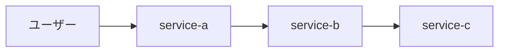

# システムアーキテクチャ設計書

<!-- TODO(claude): このファイルはスケルトンです。既存プロジェクトのディレクトリ構造、
     docker-compose.yml、インフラ設定ファイルなどを読み、アーキテクチャを記述してください。 -->

## 1. 全体構成

<!-- TODO(claude): Mermaid 記法でシステム全体構成図を記述 -->

## 2. サービス一覧

<!-- TODO(claude): 各サービスの責務・技術スタックを記述 -->

| サービス | 役割 | 言語/フレームワーク | ポート |
|---------|------|-------------------|-------|
| service-a | <!-- TODO --> | <!-- TODO --> | <!-- TODO --> |
| service-b | <!-- TODO --> | <!-- TODO --> | <!-- TODO --> |
| service-c | <!-- TODO --> | <!-- TODO --> | <!-- TODO --> |

## 3. サービス間通信方式

<!-- TODO(claude): REST / gRPC / メッセージキュー等 -->

## 4. データストア

<!-- TODO(claude): 使用する DB と責務分担 -->

## 5. 認証・認可アーキテクチャ

<!-- TODO(claude): 認証方式（セッション / JWT / OAuth 等）と認可の仕組み -->

## 6. インフラ構成

<!-- TODO(claude): クラウド / オンプレ / Kubernetes / Docker 等 -->

## 7. デプロイ戦略

<!-- TODO(claude): CI/CD、環境（dev/staging/prod）、ロールバック戦略 -->

## 8. スケーリング方針

<!-- TODO(claude): 水平/垂直スケール、ボトルネック、キャッシュ戦略 -->

## 9. 監視・ロギング

<!-- TODO(claude): ログ集約、メトリクス、アラート -->

---

**関連ドキュメント:**
- [product-requirements.md](product-requirements.md)
- [service-contracts.md](service-contracts.md)
- [security-guidelines.md](security-guidelines.md)
