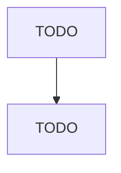

# 機能設計書

<!-- TODO(claude): このファイルはサービス固有の機能設計を記述します。
     `/generate-submodule-docs` 実行時に Claude がサブモジュール内のソースを読んで埋めます。 -->

## コンポーネント設計

<!-- TODO(claude): サービスの主要コンポーネント / レイヤ構成を記述。
     - Backend なら: Controller / Service / Repository / Domain などのレイヤ
     - Frontend なら: ページ / コンポーネント / 状態管理 / API クライアント
     - BFF なら: Route / Resolver / Backend クライアント / Schema 変換
     既存の src/ 配下のディレクトリ名を根拠に書くこと。
     可能なら Mermaid 図で関係性を示す。 -->

## データモデル

<!-- TODO(claude): このサービスが扱う主要なドメインモデル / エンティティ。
     - DB テーブルがある場合: ER 図 (Mermaid erDiagram) と各テーブルの責務
     - Frontend の場合: 画面で扱うデータ型の概要
     models/, entities/, schema.prisma, migrations/ 等から抽出。 -->

## API 設計（Backend / BFF の場合）

<!-- TODO(claude): エンドポイント一覧と概要。
     - REST: メソッド + パス + 概要
     - gRPC: サービス + RPC 名 + 概要
     詳細スキーマは contracts/ 側に集約し、ここでは一覧のみ。
     ルーティング定義ファイル (router.go, routes.ts, *.proto) から抽出。 -->

## UI 設計（Frontend の場合）

<!-- TODO(claude): 主要画面と画面遷移。
     - 画面一覧（pages/ または app/ 配下のルート）
     - 画面遷移図 (Mermaid)
     - 共通レイアウト / デザインシステム
     上記が該当しない場合（Backend/BFF）はこのセクションを削除してよい。 -->

## 主要ユースケース

<!-- TODO(claude): このサービスが対応する代表的なユースケースを 3-5 個。
     ユーザーストーリー形式（"〜として、〜したい、なぜなら〜"）でも箇条書きでも可。 -->
